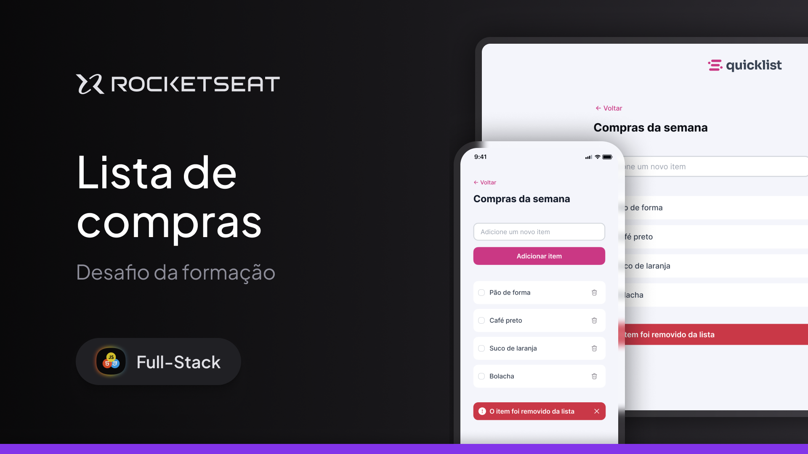

# Quicklist - Lista de Compras

## 🖼️ Prévia do Projeto

---

Este projeto, chamado Quicklist, é uma aplicação de lista de compras simples e intuitiva. Foi desenvolvido como um exercício prático no curso Fullstack da Rocketseat, com o objetivo principal de praticar a manipulação do DOM (Document Object Model) usando JavaScript.

## 🎯 Objetivo do Projeto

O foco principal do Quicklist é consolidar o aprendizado em:

- **Manipulação do DOM** → Criar, adicionar e remover elementos HTML dinamicamente.
- **Escuta de Eventos** → Gerenciar interações do usuário (cliques e submissões de formulário).
- **Lógica de Aplicação** → Implementar a lógica para adicionar e remover itens da lista de forma eficiente.
- **Validação de Dados** → Garantir que itens vazios não sejam adicionados.

---

## 💻 Tecnologias Utilizadas

- **HTML5** → Estrutura e semântica da página.
- **CSS3** → Estilo e layout com design limpo e responsivo.
- **JavaScript (ES6+)** → Manipulação do DOM e controle do comportamento da aplicação.

---

## ✨ Funcionalidades

- **Adicionar Itens** → Digite o nome de um item e clique em **“Adicionar item”** para incluí-lo na lista.
- **Remover Itens** → Cada item possui um botão de lixeira para remoção.
- **Feedback Visual** → Um alerta aparece por alguns segundos após a remoção de um item.

---

### 👨‍💻 Autor

Desenvolvido por Wigor.  
Projeto fictício com fins educacionais.
